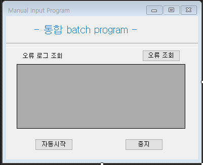

# TagValueSending
Continuous Value sending Using Thread

# The Main Form design

The start button in mainform will call another form (separate project) passing time-interval

# The Sub Form design

The start button continously sends data to targetted server using thread
